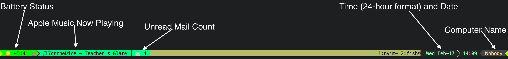
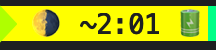

# [My](#about) configuration for Neovim and Tmux
  My configurations for Tmux and Neovim.

  # Contents:

  * [Tmux](#tmux)
    * [Demo](#demo)
    * [Requirements](#requirements-tmux)
    * [Tmux Status Bar Features](#tmux-status-bar-features)
    * [Tmux Shortcuts in this package](#tmux-shortcuts-in-this-package)
      * [Vim-like navigation](#vim-like-navigation)
    * [Other goodies](#other-goodies)
    * [Installation](#tmux-installation)
  * [Neovim](#neovim)
    * [Requirements](#requirements-neovim)
    * [Features](#features-neovim)
    * [Shortcuts included in this package](#neovim-shortcuts-in-this-package)
    * [Installation](#neovim-installation)
  * [Credit](#credit)
  * [Todo](#todo)
  * [About Me](#about)

  ## <a name="tmux">Tmux</a>
  ### <a name="demo">Demo:</a>
  
  ### <a name="requirements-tmux"></a> Requirements:
  * MacOSX
  * Mail - Mail application
  * Apple Music - Apple Music Application
  * Battery - <a href="https://github.com/tmux-plugins/tpm" target="_blank">Tmux Plugin Manager</a>

  #### <a name="tmux-status-bar-features">Tmux Status Bar Features:</a>
  * Shows battery status:
    * background color changes depending on the battery percentage
    * Shows battery percentage
    * Shows '🔋' when on battery power, '⚡' when charging, or '👍' when charged
    * shows different stages of shaded '🌕's for different percentages
      * Like this: '🌕', '🌖', '🌖', '🌗', '🌗', '🌘', '🌘', '🌑'
    * shows time remaining in battery

  
  * Shows Apple Music song currently playing:
    * Shows track name and artist name
  * Shows number of unread mails you have
  * All Mail and Apple music sections disappear when those applications are not in use:
  
  * Date and time (24-hour format)
  * Computer name

  ## <a name="other-goodies"></a> Other Goodies
  * I recommend installing <a href="https://github.com/tmuxinator/tmuxinator" target="_blank">Tmuxinator</a> as it is a great tool.

  ## <a name="tmux-shortcuts-in-this-package">Tmux Shortcuts in this package:</a>
**By default the prefix key ``Ctrl + b``**
  * Switch panes with arrow keys
  * ``<prefix>`` and then ``Ctrl + c`` to create a new session
  * ``<prefix>`` and then ``Ctrl + f`` to find a session
  * ``<prefix>`` and then ``>`` to swap current pane with the next one
  * ``<prefix>`` and then ``<`` to swap current pane with the previous one
  * ``<prefix>`` and then ``Ctrl + h`` to go to the previous window
  * ``<prefix>`` and then ``Ctrl + l`` to go to the next window
  * ``<prefix>`` and then ``tab`` to go to the last active window
  * ``<prefix>`` and then ``enter`` to enter copy mode
  * ``<prefix>`` and then ``U`` (uppercase) to show url view
  * ``<prefix>`` and then ``r`` to source the .tmux.conf

  ### <a name="vim-like-navigation">Vim-like navigation:</a>
  * ``<prefix>`` and then ``l, h, k, or j`` to move to the next pane to the right, left, up, or down, respectively.
  * ``<prefix>`` and then ``L, H, K, or J`` (uppercase) to resize a pane to the right, left, up, or down, respectively

  ## <a name="tmux-installation">Installation:</a>
  1. Make sure you have all of the [Requirements](#requirements-tmux).
  1. Download the .tmux.conf file and put it in you home directory.
  2. Download the ``segments`` directory and put it in in ``~/.tmux/``.

  ## <a name="neovim">Neovim</a>
  This is a neovim config setup for editing mostly Javascript/HTML/CSS and Rust files.

  ### <a name="requirements-neovim"></a> Requirements:
  * **<a href="https://neovim.io/" target="_blank">Neovim</a> >= 0.5**
  * <a href="https://github.com/junegunn/vim-plug" target="_blank">Vim-Plug</a>
  * <a href="https://rustup.rs" target="_blank">Rustup</a>
  * <a href="https://rust-analyzer.github.io/manual.html#rust-analyzer-language-server-binary" target="_blank">Rust analyzer</a> - for Rust linting
  * <a href="https://git-scm.com/downloads" target="_blank">Git</a> - to use vim-fugitive (git wrapper for Neovim/vim)
  * <a href="https://discord.com/" target="_blank">Discord</a> - For the Neovim Rich Presence
  * Firenvim <a href="https://chrome.google.com/webstore/detail/firenvim/egpjdkipkomnmjhjmdamaniclmdlobbo" target="_blank">Browser Extension</a> - For Neovim in your browser!!!!

  ### <a name="features-neovim">Features:</a>
  * LSP config for rust-analyzer linting of the Rust language
  * Autocompletion for Rust
  * <a href="https://github.com/haishanh/night-owl.vim" target = "_blank">Night Owl</a> theme for Neovim
  * <a href="https://github.com/sheerun/vim-polyglot" target="_blank" >vim-polyglot</a> for syntax highlighting of different file types (lazy-loading)
  * <a href="https://www.emmet.io/" target="_blank">Emmet</a> for all file types by way of <a href="https://github.com/mattn/emmet-vim" target="_blank">emmet-vim</a>
  * <a href="https://github.com/tpope/vim-fugitive" target="_blank">Git Fugitive</a>
  * Live Markdown preview through <a href="https://github.com/euclio/vim-markdown-composer" target="_blank">Markdown-composer</a>
  * Rich Presence for <a href="https://discord.com/" target="_blank">Discord</a> via <a href="https://github.com/andweeb/presence.nvim" target="_blank">presence.nvim</a> with an option to hide certain workspaces by name (see presencerc.vim file under ``plug-config/``)
  * Neovim in your browser via <a href="https://github.com/glacambre/firenvim" target="_blank">Firenvim</a>
  * Automatic code fold loading.
  * Bracket Pair colorizer for vim by way of <a href="https://github.com/luochen1990/rainbow" target="_blank">Rainbow</a>
  * Colorizer for vim by way of <a href="https://github.com/norcalli/nvim-colorizer.lua" target="_blank">nvim-colorizer.lua</a>
  * Table mode for vim through <a href="https://github.com/dhruvasagar/vim-table-mode" target="_blank">Vim Table Mode</a>
  * <a href="https://github.com/vim-airline/vim-airline" target="_blank">Airline</a> Status bar
  * Vim tips on startup by way of <a href="https://github.com/michaelb/vim-tips" target="_blank">Vim Tips</a>
  * Automatically copy and paste from normal register to allow copy and pasting to and from vim
  * Automatically unhighlight after your search is done with <a href="https://github.com/romainl/vim-cool" target="_blank">vim-cool</a>
  <a href="https://github.com/nvim-telescope/telescope.nvim" target="_blank">Telescope</a> plugin

  ### <a name="neovim-shortcuts-in-this-package">Shortcuts included in this package:</a>
  **By default the leader key is ``<space>``**
  * Opening any markdown file automatically opens the markdown composer
  * ``tab``for completion in rust
  * ``tab + s`` for smart completion in rust
  * ``Ctrl + ]`` to go to definition in rust
  * ``K`` (uppercase) for hover info
  * ``<movement> + gc`` To comment/uncomment by movement
  * ``gcc`` To comment/uncomment current line
  * ``<leader> + gs`` to show git status from Git fugitive.
  * ``<leader> + h`` to resolve a conflict by taking accepting the left side.
  * ``<leader> + l`` to resolve a conflict by taking accepting the right side.
  * ``<leader> + ff`` to find a file with telescope.Nvim
  * ``<leader> + fc`` to search commands with telescope.nvim
  * ``<leader> + fg`` for telescope live grep
  * ``<leader> + fh`` to search for help tags with telescope.Nvim
  * ``<leader> + fb`` to search current open Nvim buffers with telescope

  ### <a name="neovim-installation">Installation:</a>
  1. Make sure you have all of the [Requirements](#requirements-neovim).
  2. Download the init.vim file and put it in ``~/.config/nvim/``.
  3. Download the plug-Config folder and also put it in ``~/.config/nvim/``.
  4. Restart Neovim if you already have it open.
  5. Run ``:PlugInstall``.
  6. Execute the following command to install the necessary script for firenvim to work:
   ``` 
    $ nvim --headless "+call firenvim#install(0) | q"
   ```

  # <a name="credit">Credit</a>
  * Inspired by <a href="https://github.com/erikw/tmux-powerline" target="_blank">Tmux-Powerline</a>
  * Some Keyboard shortcuts inspired by <a href="https://github.com/gpakosz/.tmux" target="_blank">https://github.com/gpakosz/.tmux</a>

  # <a name="todo">Todo</a>
  - [ ] Remake mail checker using Gmail api instead of applescript
  # <a name="about">About the creator</a>
  I am a fourteen-year-old budding programmer. This is my first public Github repo. Any feedback would be much appreciated! Please post your comments under the Discussions tab.
